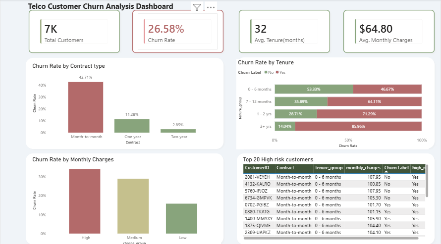

# Telco Customer Churn Analysis

**Project Overview**  
This project analyzes customer churn for a telecommunications company. The goal is to identify churn drivers, calculate churn rates, and highlight high-risk customers to help the business prioritize retention strategies. SQL was used for data exploration and cleaning, while Power BI was used for visualization and actionable insights.

---

## Dataset
- **Source:** Kaggle Telco Customer Churn dataset  
- **Number of records:** ~7,032 customers  
- **Key fields used:** CustomerID, Contract, Tenure, MonthlyCharges, Churn  
- **Notes:** No missing values or duplicate entries; TotalCharges converted to numeric for analysis.

---

## SQL Queries
- Data cleaning and preprocessing  
- Churn rate calculations by contract type, tenure, and monthly charges  
- Identification of high-risk customers  
- Stored in the `sql/` folder as `churn_analysis_queries.sql`

---

## Power BI Dashboard
- Interactive dashboard file: `PowerBI/Dashboard.pbix`  
 
 
- Dashboard includes:  
  - KPI Cards: Overall churn, average tenure, average monthly charges  
  - Churn by Contract Type  
  - Churn by Tenure Group  
  - Churn by Monthly Charges  
  - High-Risk Customer Table (Top 20 customers)

---

## Key Insights
- Month-to-month and new customers (0–6 months tenure) have the highest churn  
- Customers with higher monthly charges are more likely to churn  
- A small group of high-value customers contributes disproportionately to churn risk  
- Early-stage churn is critical — targeting new high-paying customers is essential

---

## Recommendations
- Implement **targeted retention strategies** for new, high-paying customers  
- Offer **incentives to switch to longer-term contracts**  
- Improve **onboarding for new customers** to increase engagement  
- Focus on **top high-risk customers** for personalized retention campaigns

---

## Tools Used
- **SQL** – Data extraction, cleaning, and analysis  
- **Power BI** – Dashboard creation and visualization  
- **Power Query** – Data transformation  

---

**Author:** Cynthia Mandere  
**Portfolio:** (https://meteor-lan-6cc.notion.site/Telco-Customer-Churn-Analysis-2e1af841c5d8807c9b3fd033b92d2105

